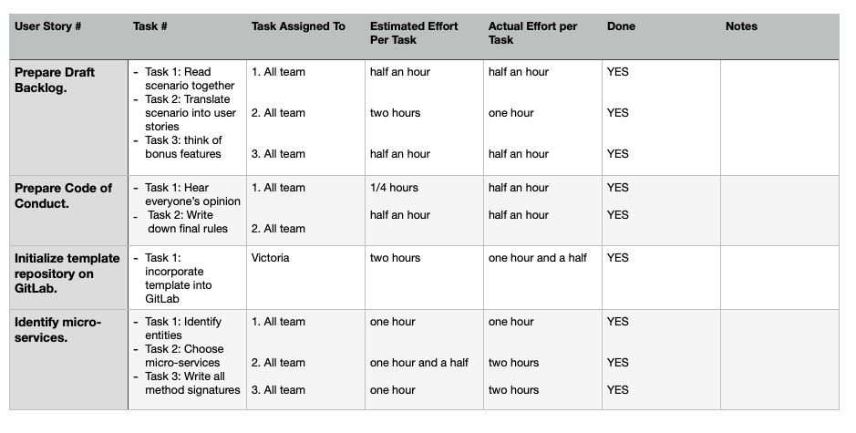

# Sprint Retrospective, Iteration Week 2 
**Project**: Software Engineering Methods, Scenario 3.

**Group**: 18A

## Main Problems Encountered

### Problem 1 

**Description**:

- The group did not have a broad understanding of how the micro-services work, so we could not properly justify our design choices.

**Reflection**: 

- We decided that everyone needs to study in more depth what micro-services are and how they function.
- We also had to think of how we should divide the micro-services.

### Problem 2

**Description**:

- GitLab was a bit too all over the place. It was quite hard to understand what everyone needed to do.

**Reflection**: 

- After finishing the backlog we took the decision of translating the user stories from it through issues in GitLab.
- One thing that was missing was represented by the non-functional features in our backlog, so we decided to find those quickly and add them to the backlog.

## Adjustments for the Next Sprint Plan 
*Motivate any adjustments that will be made for the next Sprint Plan*. 

-	Finish the Backlog.
-	Decide the main entities used in each service.
-	Work on draft of lab assignment 1 - Task 1.
-	Distribute the MUST-HAVES once the backlog is finished. 

