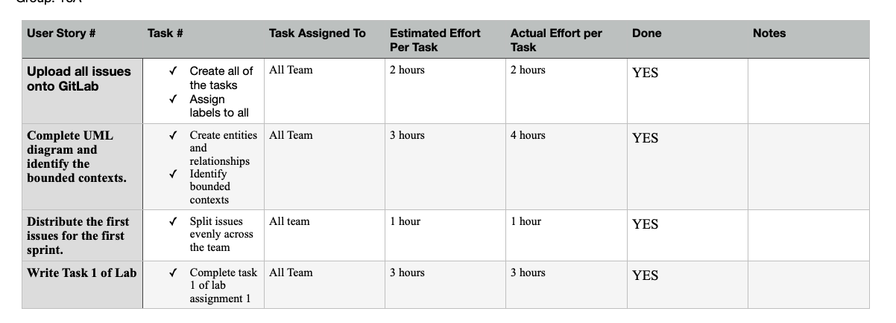

# Sprint Retrospective, Iteration Week 3
**Project**: Software Engineering Methods, Scenario 3.

**Group**: 18A

## Main Problems Encountered

### Problem 1 

**Description**:

- The team found it quite difficult to agree how to split the project effectively into microservices.

**Reflection**: 

- We decided to go back to the UML diagram and re-think the split from the ground up.

## Adjustments for the Next Sprint Plan 
*Motivate any adjustments that will be made for the next Sprint Plan*. 

- Initialise the microservice subprojects onto gitlab. 
- Divide the responsibility of adding components and modules of microservice
- Finalise the architecture planning of each microservice
- Draft Task 2 of Lab Assignment 1 

