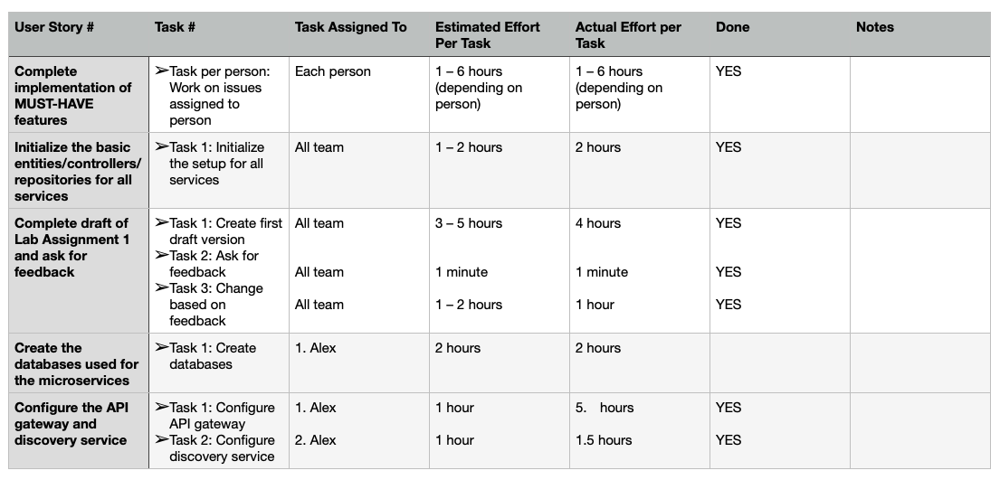

# Sprint Retrospective, Iteration Week 4
**Project**: Software Engineering Methods, Scenario 3.

**Group**: 18A

## Main Problems Encountered

### Problem 1 

**Description**:

- The PMD and Checkstyle don’t run on the GitLab repository

**Reflection**: 

- We put the PMD and Checkstyle in the project
- We checked and made sure it was also ran on the repository

### Problem 2

**Description**:

- The issues were not properly structured and were not all on GitLab.

**Reflection**: 

- We decided and created a template for how an issue should look like
- We divided who put which issue on GitLab
- We put the issues correctly on GitLab

## Adjustments for the Next Sprint Plan 
*Motivate any adjustments that will be made for the next Sprint Plan*. 

- Finalize all MUST-HAVE features
- Test all MUST-HAVE features
- Ensure that the design patterns are finalized
- Ensure that the microservices are properly connected to the database by configuring the `application.properties` file

