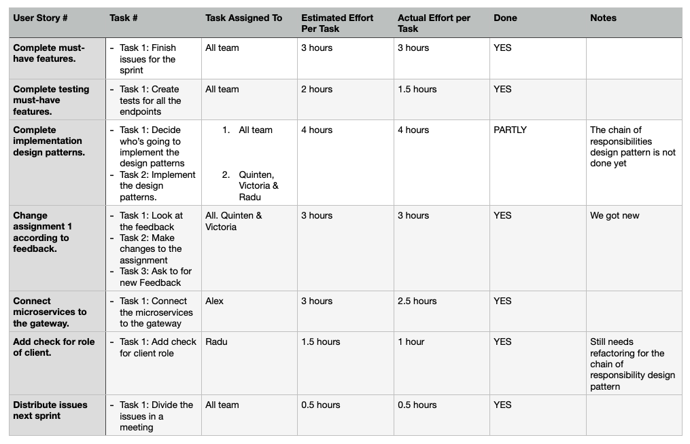

# Sprint Retrospective, Iteration Week 5
**Project**: Software Engineering Methods, Scenario 3.

**Group**: 18A

## Main Problems Encountered

### Problem 1 

**Description**:

- We did not get to finish the implementation of all design patterns 

**Reflection**: 

- We will now focus on implementing the design patterns and ensure that all endpoints needed indeed exist and are tested. 

### Problem 2

**Description**:

- We realised that we had to merge the `userservice` and `authenticationservice`, since they had too many dependencies. 

**Reflection**: 

- We merged the services together and ensured that all endpoint calls in both are resolved and work. 

## Adjustments for the Next Sprint Plan 
*Motivate any adjustments that will be made for the next Sprint Plan*. 

- Distribute the issues for COULD-HAVES
- Decide on who works on what Design Pattern Implementation
- Continue to work on the lab assignment 1 text.  

