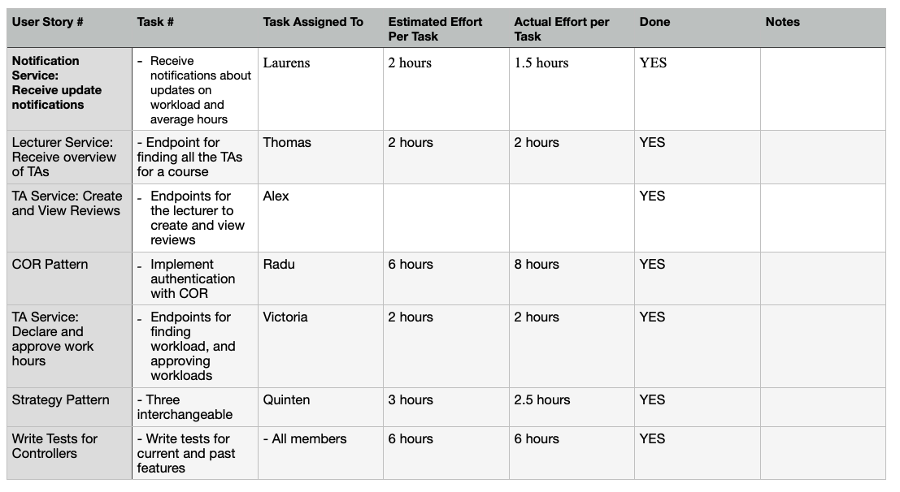

# Sprint Retrospective, Iteration Week 6
**Project**: Software Engineering Methods, Scenario 3.

**Group**: 18A

## Main Problems Encountered

### Problem 1 

**Description**:

- Unequal contribution on GitInspector 

**Reflection**: 

- This was not our intention. 
- We will now distribute issues *only* to members that lack contribution.
- Members who don't lack contribution will not receive many features. 
- We will think of ways to ensure that the GitInspector is more balanced. 

### Problem 2

**Description**:

- We are unsure about how to implement the COR pattern for lab assignment 1. 

**Reflection**: 

- We have proposed several ways to implement this design pattern and ask for our TA's advice.
- We follow his advice and implement the design pattern accordingly. 

## Adjustments for the Next Sprint Plan 
*Motivate any adjustments that will be made for the next Sprint Plan*. 

- Even out contribution on GitInspector. 
- Finalise and submit all material for lab assignment 1. 
- Think of ways to refactor the project. 
- Start with integration testing. 

